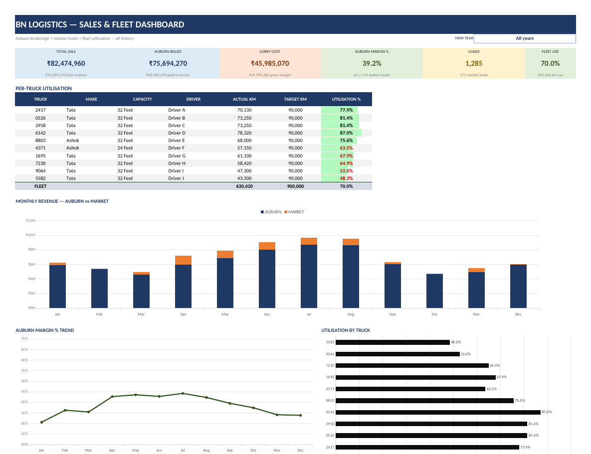
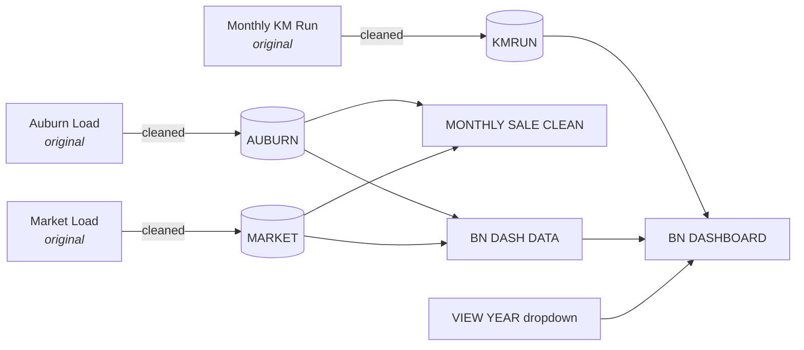
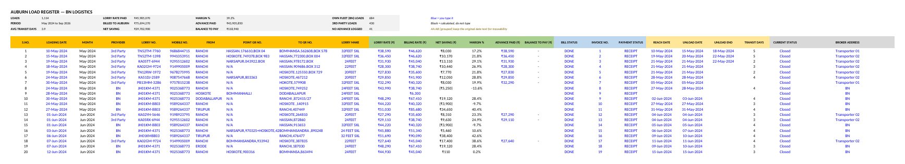

<p align="center">

</p>

<p align="center">


</p>

<p align="center">
<a href="#at-a-glance">Overview</a> ·
<a href="#workbook-map">Workbook map</a> ·
<a href="#what-was-restructured">Restructuring</a> ·
<a href="#dashboard-mechanics">Dashboard</a> ·
<a href="#validation">Validation</a> ·
<a href="#how-to-use">How to use</a> ·
<a href="#repository-structure">Structure</a>
</p>

---

An Excel 365 workbook I restructured for a logistics operation that does two things: it moves a garment manufacturer's freight (the **Auburn** loads) using its own trucks and hired third-party lorries, and it sells its own fleet's spare capacity to outside customers (the **Market** loads).

The original workbook was a set of hand-kept sheets with mixed data types, free-text dates, inconsistent labels and a summary that didn't tie back to the load register. I rebuilt it as **structured Excel tables with formula-driven KPIs, a monthly reconciliation and an interactive dashboard**, and kept the original sheets (hidden) for traceability.

> **The data in this repository is anonymised.** Party names, phone numbers, vehicle registrations, drivers, reference numbers and free-text remarks have been masked, and every amount has been rescaled. The structure, formulas, data-quality problems and row counts are real. The ₹ values are not. See [Anonymisation](#anonymisation).



---

## At a glance

| | |
|---|---|
| **Tool** | Excel 365: structured tables, `SUMIFS`/`COUNTIFS`, dynamic named range, data validation, conditional formatting, native charts |
| **Scope** | 1,114 Auburn loads (684 own fleet, 430 third party) · 171 market loads · 10 trucks × 6 months of km logs · May 2024 to Sep 2026 |
| **Formulas** | ~11,400 formula cells. Every KPI on the dashboard traces back to a row in a table |
| **Reconciliation** | Load register = Monthly Sale = pivot report, matched to the rupee (see [Validation](#validation)) |
| **File** | [`workbook/FTL_Logistics_Expense_Tracker_SAMPLE.xlsx`](workbook/FTL_Logistics_Expense_Tracker_SAMPLE.xlsx) |

---

## Workbook map

Coloured tabs are the restructured layer. The uncoloured or hidden tabs are the original sheets, kept as the audit trail.

| Tab | Status | Role |
|---|---|---|
| **BN DASHBOARD** | 🔴 new | KPI tiles, per-truck utilisation and three charts, all driven by a **VIEW YEAR** dropdown |
| **AUBURN LOAD CLEAN** | 🟢 rebuilt | Table `AUBURN` holds one row per Auburn load: lorry cost, billing, margin, advance, balance and transit days |
| **MARKET LOAD CLEAN** | 🟢 rebuilt | Table `MARKET` holds own-truck loads sold to outside customers, with receivables and POD tracking |
| **KM RUN CLEAN** | 🟢 rebuilt | Table `KMRUN` holds truck-month km against target, with utilisation and incentive |
| **MONTHLY SALE CLEAN** | 🔴 rebuilt | Monthly roll-up built with `SUMIFS`/`COUNTIFS` from `AUBURN` and `MARKET`. Nothing is typed in by hand |
| BN DASH DATA | hidden helper | Chart series, year list and the filtered calendar-month series |
| Auburn Load · Market Load · Monthly Sale · Monthly KM Run | hidden, original | The original sheets, unchanged apart from anonymisation |
| Daily Tracking · Report | original | Daily truck plan/actual sheet and the original pivot report |



---

## What was restructured

| Problem in the original | Fix in the clean layer |
|---|---|
| **Dates stored as text** in five different shapes (`10.05.2024`, `26-12-204`, `15/05/2024./18/05/2024`, `SAME DAY`…). About 1,040 reach/unload values weren't real dates | Converted to true dates. Combined "unload start / end" text was split into `UNLOAD DATE` + `UNLOAD END`. The **original text is kept** in grouped columns `REACH AS LOGGED` / `UNLOAD AS LOGGED` for traceability |
| **Month typed by hand** as 29 different labels (`May`, `JUNE `, `JUNE,26`, a stray date…) | `MONTH = EOMONTH(date,-1)+1`, so the month can't drift from the date |
| **Provider spelt 8 ways** (`BN`, `BN `, `3rd party`, `3rdParty`, `3rd  party `…) | Two values: `BN`, `3rd Party` |
| **Status spelt 5 ways** (`Closed`, `closed`, `closed `, `-`…) | `Closed` / `Running` |
| **150 blank rows** inside the table, and hand-typed serial numbers (including a stray `S`) | Removed. `S.NO.` is formula-driven so it can't break |
| **Net saving / balance** as a mix of typed numbers and formulas | One consistent formula per column, with blank-safe guards |
| **Market sheet** had `-` typed into amount cells, a `45K` text rate and POD refs mixed into the status field | Numeric columns stay numeric. `BALANCE DUE` and `DAYS TO RECEIVE` are formulas, and `POD STATUS` is separate from `POD REF` |
| **Truck numbers** stored as numbers for some trucks and text for others (`2417` vs `"0526"`) | All stored as text, so lookups (`MATCH`) can't miss the leading-zero truck |
| **Monthly Sale typed by hand**: 9 of 28 months didn't tie to the load register (up to 9.6% off) and 3 month totals ≠ Auburn + Market | Rebuilt as `SUMIFS` from the tables, so it **always ties** |
| No consolidated view | **Dashboard** with year filter, KPI tiles, margin trend, revenue split and fleet utilisation |

The full column-by-column mapping is in [`docs/restructuring-notes.md`](docs/restructuring-notes.md).



---

## Dashboard mechanics

- **VIEW YEAR** (`K3`) is a data-validation list fed by the dynamic named range `YearList`. That range is an `OFFSET` over a year list generated from `MIN`/`MAX` of the loading dates, so new years appear on their own.
- Two helper cells turn the selection into a date window (`FROM` / `TO`). Choosing **All years** opens the window from 1990 to 2100.
- Every KPI is a `SUMIFS`/`COUNTIFS` over the table columns with `">="&FROM` and `"<="&TO` criteria.
- Chart series return `NA()` outside the window, so Excel leaves gaps instead of plotting zeros.
- Per-truck utilisation looks up make, capacity and driver from `KMRUN` with `INDEX/MATCH`. A data bar plus a red/green threshold at 70% flags under-used trucks.

Formula details are in [`docs/formula-reference.md`](docs/formula-reference.md), and every column is described in [`docs/data-dictionary.md`](docs/data-dictionary.md).

---

## Validation

These checks were run on the restructured workbook (and re-run on this anonymised copy):

| Check | Result |
|---|---|
| Row count, original vs clean (Auburn) | 1,114 = 1,114, row-for-row aligned |
| Σ Billing in `AUBURN` = `MONTHLY SALE CLEAN` total = pivot `Report` grand total | ✅ ties |
| Σ Lorry cost: register = Monthly Sale = Report | ✅ ties |
| `NET SAVING = BILLING − LORRY` and `BALANCE = LORRY − ADVANCE` on every row | ✅ |
| Provider split (BN 684 + 3rd Party 430 = 1,114) | ✅ |
| Independent recalculation (LibreOffice) vs Excel cached values | 11,435 formula cells checked. All match except 1 known engine difference in an *original* sheet (`"" − number`) |

### Open exceptions (flagged, not silently "fixed")

| # | Exception | Rows | Suggested action |
|---|---|---|---|
| 1 | Transit days negative or > 300 because of year typos in dates (e.g. the original text `26-12-204` was read as 2025 instead of 2024) | S.NO 7, 242, 279, 284 | Correct the date and keep the logged text |
| 2 | Transit = 28 days on 4 consecutive loads. Probably a month typo | S.NO 395–398 | Confirm with the trip sheet |
| 3 | 3 own-fleet loads billed below lorry cost (negative margin) | S.NO 8, 11, 15 | Verify the rate |
| 4 | `LORRY MAKE` still has 21 spellings (`32FEEET`, `32FFET`, `332FEET`…) and `BROKER ADDRESS` has near-duplicates | — | Map them through a master table (`raw → standard`) |
| 5 | The same truck appears in several registration formats (`JH01KM8803`, `JH0KM-8803`, `JH001KM-4371`) | — | Normalise with a regex-style rule or a vehicle master |
| 6 | Header **NET SAVING** (Σ of the row column) is lower than **Billing − Lorry** because 2 rows have one rate missing | 2 rows | Fill the rates, or show the difference as a reconciling item |
| 7 | `CUSTOMERS` KPI uses `SUMPRODUCT(1/COUNTIF)`, which returns 24.000000000000007 in Excel | — | Wrap it in `ROUND(…,0)`. Customer names with remarks attached (`… + 05DAYS HALTING`) count as separate customers |
| 8 | Dashboard calendar series run from May 2024 to May 2027 (`A4:A40`). `MONTHLY SALE CLEAN` runs to Dec 2028 | — | Extend the helper range before mid-2027 |
| 9 | `Daily Tracking` (original sheet) has 10 `#REF!` formulas | — | Out of scope for this pass |

---

## How to use

1. Add new loads as new rows at the bottom of `AUBURN` / `MARKET` / `KMRUN`. The tables expand and the formula columns fill down.
2. Type only in the **blue** input columns. **Black** columns are calculated.
3. On **BN DASHBOARD**, pick a year (or *All years*) in **VIEW YEAR**.
4. Check **MONTHLY SALE CLEAN** each month. Its total must equal the register's header KPIs.

---

## Anonymisation

The published workbook was produced from the live file with an XML-level script, so tables, formulas, charts, conditional formatting and the pivot all survive intact:

- **Masked:** transporter/broker and customer names (→ `Transporter 01`, `Customer 01`…), vendor names in GR references, driver names (→ `Driver A`…), phone numbers, vehicle registration series and numbers (one consistent mapping, so the same truck stays the same truck), GR/POD reference digits, and free-text remarks (→ a remark category such as `LORRY HALTING - EXTRA CHARGE`).
- **Rescaled:** all ₹ amounts, with margins compressed. Relationships hold: `advance = lorry rate` stays true where it was true, and sign of margin is preserved. Real totals and margins are **not** recoverable from this file.
- **Unchanged:** dates, routes and cities, km figures, row counts, and every data-quality problem described above.
- **Removed:** document author metadata, printer settings and an add-in task pane.

---

## Repository structure

```
├── README.md
├── workbook/
│   └── FTL_Logistics_Expense_Tracker_SAMPLE.xlsx
├── docs/
│   ├── restructuring-notes.md   # original → clean mapping, issues, validation
│   ├── data-dictionary.md       # every column of AUBURN, MARKET, KMRUN, MONTHLY SALE
│   └── formula-reference.md     # KPI, dashboard and helper formulas
└── images/
    ├── banner.svg
    ├── dashboard.png
    └── auburn-load-clean.png
```

Screenshots are rendered from the sample file in LibreOffice, so chart colours differ slightly from Excel.

---

**Author:** Tanmay Mandal, Business Analysis · Operations · ERP
© Tanmay Mandal. All rights reserved. Shared for portfolio viewing only.
